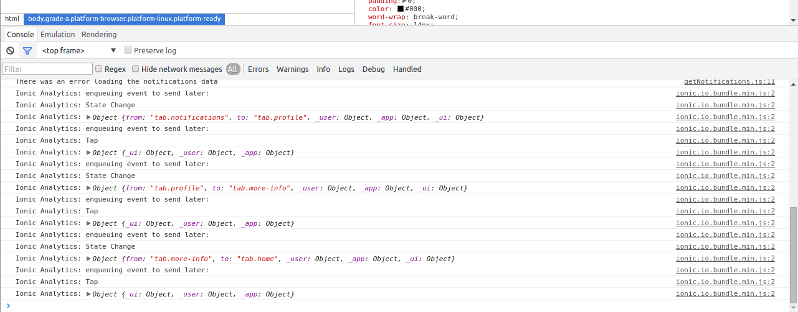
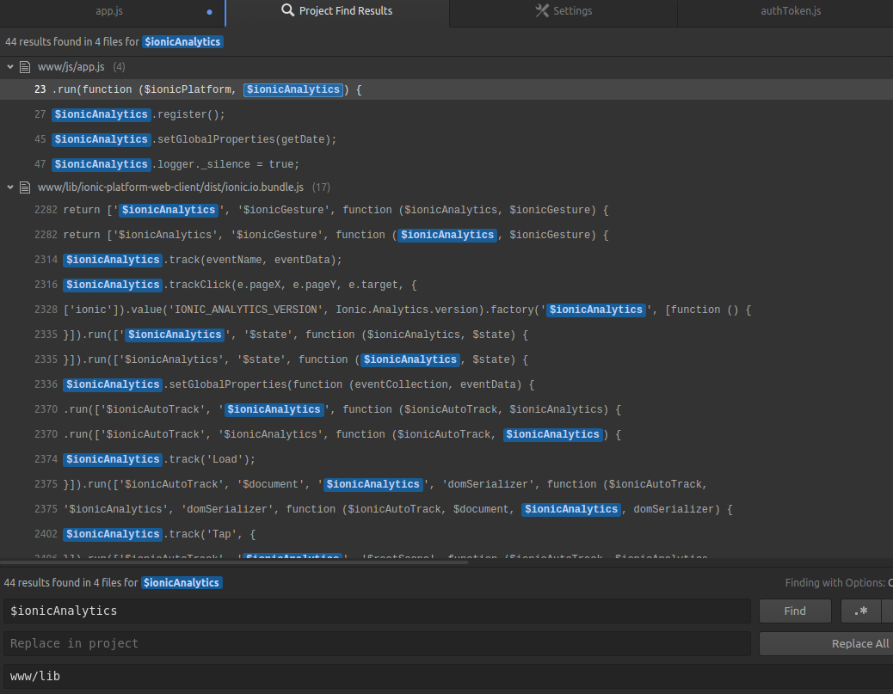

Ionic provides a very nice system for you to track the usage of your app with the $ionicAnalytics plugin. But if you are reading this you probably already know that, so let's get to the heart of the matter.


Ionic provides a very nice system for you to track the usage of your app with the $ionicAnalytics plugin. But if you are reading this you probably already know that, so let's get to the heart of the matter.

$ionicAnalytics for some reason logs everything it is doing. If you are debugging it that is fine, but not all the time. The documentation doesn't say anything about this, so it comes down to us to find a solution to make it shut up.





When the documentation is not enough what better solution than looking at the source code and trying to figure out what kind of sorcery it is doing? Inside your `www` folder you will find a `lib` folder containing all of ionic's *sauce*. My beloved [Atom](https://atom.io/) (also open source, by the way) has an option to *Search in Directory*, which is exactly what we need. You could also do it with `grep` and the terminal, which gives you extra points for style, but that's not the point of this post.





We get loads of results in a couple of different files. Some of them finish in `.min.js`.  Those are minified files, we won't understand anything so we don't even go there. But we don't have to investigate too much to find the culprit, the console log comes from `ionic.io.bundle.min.js` so let's look at it's unminified version: `ionic.io.bundle.js`.

 Well, there are 17 occurrences of `$ionicAnalytics` there. But most of them are just references to it. We are interested in seeing what's going on when this is defined. As 17 is not much we can just go through them and check where that happens. We then find this piece of code:


``` javascript
  angular.module('ionic.service.analytics', ['ionic']).value('IONIC_ANALYTICS_VERSION', Ionic.Analytics.version).factory('$ionicAnalytics', [function () {
    if (!IonicAngularAnalytics) {
      IonicAngularAnalytics = new Ionic.Analytics("DEFER_REGISTER");
    }
    return IonicAngularAnalytics;
  }])
```


There we go! That's the definition of the service. But that doesn't say much. It just returns an object created with this `Ionic.Analytics` constructor. Well, let's look for the definition of this constructor then.


But that is kind of tricky. Because it is a property of the `Ionic` object and it may be defined inside of it without using the dot notation and looking just for `Analytics` returns 73 results, which is a lot to go through. But we are smarter than that. If it is a property it must have been assigned a value at some point, so let's look for `Analytics =`. This shrinks our search space to 6 occurrences and as there it is, the first result is exactly what we were looking for.


``` javascript
	var Analytics = (function () {
  function Analytics(config) {
```


If you give a quick look at this function this line will catch your attention


``` javascript
this.logger._silence = true`
```


This seems to be exactly what we are looking for. But this logger stuff seems to be set to true already, why is it still logging stuff? We now could carefully read through the 400 lines of the function and see what exactly is going on. Or we can just try to set this again and hope for the best. With so many deadlines I like the last one a lot better. That is how we do it:

``` javascript
	$ionicAnalytics.logger._silence  = true;
```

Tadah! It works. Now we have a nice and clean console and a sourcedigger badge.

---

**TL;DR**

``` javascript
	$ionicAnalytics.logger._silence  = true;
```

---
