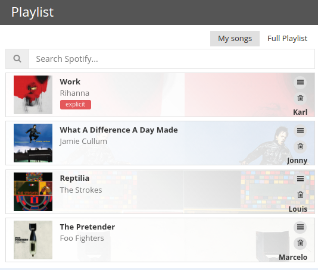

It was my most effective attack, three companies went down. It was also accidental and with undesired consequences.

At work we have two very distinct groups: the pop-lovers and the metal-heads. As you might expect, metal-heads are not very fond of Rihanna, and neither are pop-lovers very appreciative of Guns & Roses. To end our frequent discussions about which station should the radio on, we decided to build a widget where everyone could submit whatever songs they liked and they would be automatically arranged in turns and played from Spotify. Fair and easy.

I was the one commissioned with the task of building the widget. I built two components. A little server to receive all songs requests, organise them, and add them to a Spotify playlist. And the widget itself, to allow song choosing, reordering, and viewing of how the general playlist was looking like.



I built it, it worked, everyone was happy.

But then stranger things began to happen. We had the Spotify widget running only on Fridays, and as it happened, for the first time ever the whole office's internet began to drop. At a certain point in the afternoon websites would suddenly take many minutes to load or the browser would simply state that we were offline. The music would also stop, but that wasn't really a mystery: if we don't have internet, Spotify will not work. Nothing strange there.

Nonetheless, I would also note that my little server would be complaining about a Spotify `request_limit_exceeded` error. But nothing I should worry about, given that there was no internet anyway. In any case, I found out that if I just restarted the server script the error would go away. In practice it was probably an OAuth token expiration problem. When I restarted the script it automatically refreshed the token.

So far so good.

We however, began to have this internet dropping problem every Friday, which was a great pain as people in the office just couldn't do their jobs without internet. Three medium enterprises that share the same office space completely on hold. We called the internet provider several times. We complained. We asked if other people in the building were having the same problems (and they were not). Nothing could ease our distress. We then began to wonder whether there was anything interfering with our connection. Maybe some other company nearby performed a backup every Friday. Maybe there are engineering works that are only performed on Fridays. Anything you could think of that could possibly happen on a Friday.

It was then that [Chris](https://twitter.com/lown_coco) began to speculate about a correlation between the internet dropping and our jolly innocent songs widget. He noted that it always happened when the widget was on. I, obviously, immediately dismissed the conjecture, as I wrote the widget and server myself and was sure it did nothing more than sending some songs to Spotify with a single request every 15 minutes or so. This alone could never ever bring down the internet of an entire office.

It was right there, my friends, at the apex of conviction that my knowledge blinded me and as a skilled magician, pulled the tablecloth from underneath my porcelain cup. Because I could see absolutely no relation between my script and an internet drop, I dismissed Chris' theory completely. Many times. Mind you, it was not one day, but for many weeks.

Until today afternoon arrived. The internet was down, the music was off, no one able to work and my server complaining about the `request_limit_exceeded`. Chris said let's try turning the playlist server off. We turned it off. The internet was immediately back.

I could not believe it! How comes? What on earth was happening over there? It demanded immediate investigation.

Actually, I did not need to evaluate the code to uncover the insidious bug. A mere moment of serious consideration of the issue revealed the culprit. You can witness it in action right here:


``` javascript
    // submit next track around 10 seconds before the tracklist ends.
    const timeToNextSubmission = timeToPLaylistEnd - 10000; // in ms

    // Schedule next update
    setTimeout(() => this.submitToSpotify(), timeToNextSubmission);
```


As you can see, more songs will be submitted to Spofity 10 seconds before the currently playing playlist reach its end. That doesn't sound so bad, as every submission would add some 15 minutes of songs to the playlist, scheduling the next submission to around 14 minutes and 50 seconds in the future. But what happens if the submission fails? How much time will it take for the playlist to end? Well, it will take less than 10 seconds, so let's submit stuff now! But what if nothing was added yet? Let's submit it again right now!

And here you have it. The very fast node server was sending thousands and thousands of requests per second, making the router simply overwhelmed and unable to cope with anything else. My very innocent script had turned evil and was performing a [**D**enial **O**f **S**ervice](https://en.wikipedia.org/wiki/Denial-of-service_attack) attack on my company's router, blocking other computers from accessing the internet and burning a few pounds in man-hours from my company.

The fix was really easy. First let's have a minimum delay time


``` javascript
    // submit next track around 10 seconds before the tracklist ends.
    // guarantee a minimum time of 10 seconds between submissions. To avoid a DOS attack on our router.
    const timeToNextSubmission = Math.max(timeToPLaylistEnd - 10000, 10000); // in ms

    // Schedule next update
    setTimeout(() => this.submitToSpotify(), timeToNextSubmission);
```


And then let's make sure to refresh the OAuth token whenever we have this issue again. That's it.

Many lessons were learned here.

  - First, no piece of code is above suspicion. Even when the consequences seem way out of proportion, never refrain from investigating that inconspicuous piece of code over there.

  - Second, keep ***Denial Of Service*** in mind. When writing programs that make ***http*** requests make sure to never allow requests to be continually made by placing explicit guards against it, like having a minimum delay time.

  - Third, never dismiss a logically sound proposal from a non-developer source just because it seems unlikely. The proposal, however improbable, may still point towards a real flaw.

  - Lastly, in computing there are hardly every coincidences. Always be suspicious.
