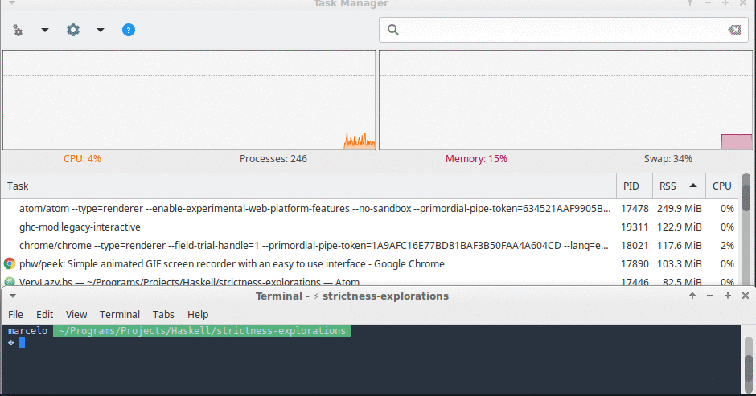
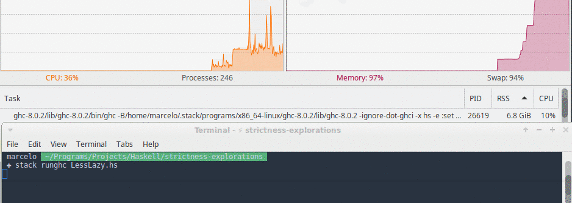
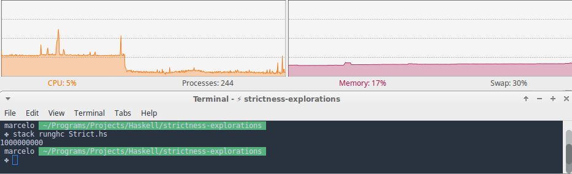
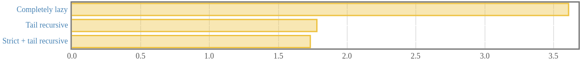

Haskell's laziness can cause problems with recursive functions if they are not handled properly. In some cases this can be dealt with by using an [accumulating parameter](https://wiki.haskell.org/Performance/Accumulating_parameter). Haskell's [wiki page](https://wiki.haskell.org/Performance/Accumulating_parameter) on the subject does a great job in explaining how that works. Here I register some benchmarks on the wiki's examples so we can see how much that matters.


I won't go into details as to why one implementation performs better than the other as the wiki's article is already very clear and concise. I will stick to showing the code and the benchmarks.

The task in our hands is to calculate the length of a list. To make sure this is working we will print the length of a really long one.

``` haskell
main = print $ len [1..1000000000] -- 1 Billion
```

## Very lazy implementation

This is our first and very naive implementation.

``` haskell
len :: [a] -> Int
len [] = 0
len (x:xs) = len xs + 1
```

In this implementation memory usage grew very quickly and we also hit a stack overflow in less than 10 seconds.



## Tail recursive implementation

In this implementation we add an accumulator parameter to our function so that we can take advantage of [tail recursion](https://wiki.haskell.org/Tail_recursion) and don't blow the stack.


``` haskell
len :: [a] -> Integer -> Integer
len []  acc    = acc
len (_:xs) acc = len xs (1 + acc)
```

This represents a great progress but the `acc + 1` part still isn't evaluated until the very end, which means we accumulate one billion thunks before the end of the function. Our stack doesn't blow but our memory usage goes through the roof.

Here is a screenshot of this function's memory usage right before my OS killed it.



## Strict + tail recursive implementation

For our last trick we use the `$!` operator to force the evaluation of the accumulator addition before our recursive call.

``` haskell
len :: [a] -> Integer -> Integer
len []  acc    = acc
len (_:xs) acc = len xs $! (1 + acc)
```

With this improvement our function runs until the end using a steady 100Mb of memory throughout.




## Speed comparison

I ran some micro-benchmarks on these functions to see how they did in smaller tasks. The following graph shows their performance when calculating the length of a list of size *100000 (one hundred thousand)*. I used the awesome [Criterion](https://hackage.haskell.org/package/criterion) package to run the benchmarks.




Execution count: Completely lazy ≈ 800x. Tail recursive ≈ 1700x. Strict + tail recursive ≈ 1700x.

We can see that just by using tail recursion we cut our function's running time in half. Removing thunk allocation in our accumulator added a slight performance improvement, but nothing too significant.

These speed rating, however, matter very little if our program will crash. The last implementation is not only the **fastest**, it is also the **safest** and **most efficient**.
