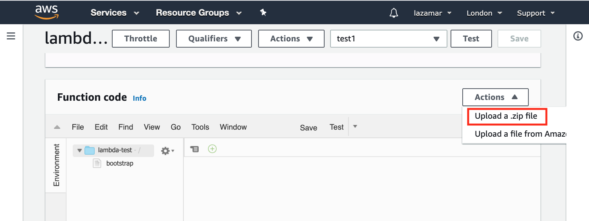
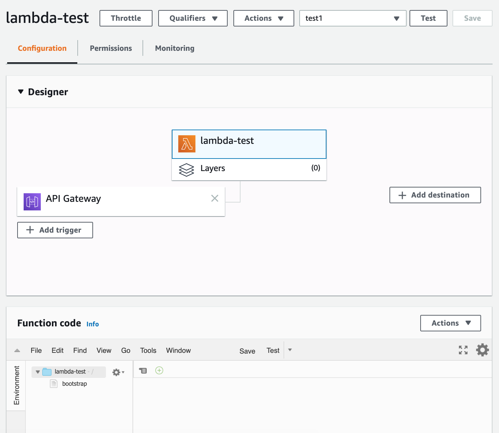

In [his post about a Telegram bot](https://www.joachim-breitner.de/blog/770-A_Telegram_bot_in_Haskell_on_Amazon_Lambda)
Joachim Breitner mentions compiling his program into a static binary to have it run in Amazon's version of
Linux without needing to build it inside a container. I was interested in experimenting with
Amazon Lambda and having statically linked Haskell programs sounded like a great idea too, so this
is a write-up of what it took to get those things working.

In the end we will have a Haskell program compiling to a statically linked binary, being built
quickly by making use of Nix and Cachix and automatically deployed to Amazon Lambda using GitHub
Actions.

The code for this post can be found at [lazamar/lambda-haskell](https://github.com/lazamar/lambda-haskell).

In Lambda we need a special wrapping layer to run Haskell code. I'm using
[aws-lambda-haskell-runtime](https://hackage.haskell.org/package/aws-lambda-haskell-runtime)
for that. I wanted to see what data from the request Amazon was making available, so the
program will simply get a request as a JSON, prettify it and return that. This is `Main.hs`,
the only Haskell file.

``` haskell
{-# LANGUAGE DeriveGeneric  #-}
{-# LANGUAGE DeriveAnyClass #-}
{-# LANGUAGE DuplicateRecordFields #-}
{-# LANGUAGE NamedFieldPuns #-}
{-# LANGUAGE OverloadedStrings #-}

module Main where

import Aws.Lambda
import Aws.Lambda.Runtime
import GHC.Generics
import Data.Aeson
import Data.Aeson.Encode.Pretty
import Data.Either
import Data.Text (Text)
import Data.Text.Lazy (toStrict)
import Data.Text.Lazy.Encoding (decodeUtf8)
import Network.HTTP.Types.Header

main :: IO ()
main =  runLambda run
  where
   run ::  LambdaOptions -> IO (Either a LambdaResult)
   run opts = do
    result <- either (error . show) id $ handler <$> (decodeObj (eventObject opts)) <*> (decodeObj (contextObject opts))
    either error (pure . Right . StandaloneLambdaResult . encodeObj) result

type Request = Value

data Response = Response
  { statusCode :: Int
  , headers :: [(Text, Text)]
  , body :: Text
  , isBase64Encoded :: Bool
  } deriving (Generic, ToJSON)

handler :: Request -> Context -> IO (Either String Response)
handler e context = return
    $ Right
    $ Response 200 mempty (toStrict $ decodeUtf8 $ encodePretty e) False
```

We can build that with Cabal and a small `lambda-test.cabal` file.

```
cabal-version:       >=1.10
name:                lambda-test
version:             0.1.0.0
author:              Marcelo Lazaroni
build-type:          Simple

executable lambda-test
  main-is:             Main.hs
  build-depends:
      base
    , aeson
    , aeson-pretty
    , text
    , aws-lambda-haskell-runtime >= 2.0.1 && < 3.0.0
    , http-types
  default-language:    Haskell2010
```

To statically link our Haskell program I used Nix and made use of the excellent
[static-haskell-nix](https://github.com/nh2/static-haskell-nix) project.

They created a [nix file](https://github.com/nh2/static-haskell-nix/blob/master/survey/default.nix)
that modifies all existing Haskell packages in Nix to have them and all of their
dependencies be statically linked.

They also keep a [list](https://github.com/nh2/static-haskell-nix/issues/4#issuecomment-406838083)
of packages that do not successfully compile with this approach. It works with more than 90% of
Stackage.

Here is my `deafult.nix`.

``` nix
# Little snippet from Niv to get our pinned dependencies
{ sources ? import ./nix/sources.nix }:
with { overlay = _: pkgs: { niv = import sources.niv {}; }; };

let
    # We use a nixpkgs version with modified configuration to build static
    # executables. From https://github.com/nh2/static-haskell-nix
    pkgs = (import (sources.static-haskell-nix + "/survey/default.nix") {
      # This is the nixpkgs revision we are modifying.
      # We pinned the revision with 'niv add NixOS/nixpkgs -a rev=<sha256>
      normalPkgs = import sources.nixpkgs {};
    }).pkgs;

    # Nix usually takes all files in the source directory into consideration and
    # busts the cache whenever any of these files change. To avoid that
    # we use hercules-ci/gitignore.nix so that nix will ignore files included in
    # our .gitignore
    gitignoreSource = (import sources.gitignore { lib = pkgs.lib; }).gitignoreSource;

    lambda-test =
        pkgs.haskell.lib.overrideCabal
            # Create a nix derivation from the cabal package
            (pkgs.haskellPackages.callCabal2nix "lambda-test" (gitignoreSource ./.) {})
            # Set flags that make sure that we are building a truly static executable
            (old: {
                  configureFlags = [
                    "-flambda"
                    "--ghc-option=-optl=-static"
                    "--extra-lib-dirs=${pkgs.gmp6.override { withStatic = true; }}/lib"
                    "--extra-lib-dirs=${pkgs.zlib.static}/lib"
                    "--extra-lib-dirs=${pkgs.libffi.overrideAttrs (old: { dontDisableStatic = true; })}/lib"
                    "--disable-executable-stripping"
                  ];
            });

    # Create a zip file ready to be sent to AWS lambda
    function-zip = pkgs.runCommandNoCC "lambda-test.zip" { buildInputs = [ pkgs.zip ]; }
      ''
          mkdir -p $out
          cp ${lambda-test}/bin/lambda-test bootstrap
          zip $out/function.zip bootstrap
      '';
in
{ inherit
    lambda-test
    function-zip ;
}
```

I used [`Niv`](https://github.com/nmattia/niv) to pin the Nix derivations I was using to precise
commits. This is great to make sure that my build will be exactly the same even if I'm on a machine
with a different revision of `nixpkgs` or if the derivations I use are updated.

Adding a package with `Niv` is super simple. Just `niv add nh2/static-haskell-nix` will pin a
version of `static-haskell-nix` in a json file under the newly created `nix` directory and by
adding two lines of code at the beginning of my Nix file to load the Niv sources I can use it
with `sources.static-haskell-nix`.

To have all of the modified Nix packages I import `sources.static-haskell-nix + "/survey/default.nix"`.
After doing that I found that the project is pinned to an old revision of `nixpkgs` and I needed
a more recent one for `callCabal2nix` (it goes into an infinite loop in the pinned one).
To override it I pinned my desired revision with `niv add NixOS/nixpkgs -a rev=<sha256>` and
used it by setting the `normalPkgs` attribute with this line:

```
      normalPkgs = import sources.nixpkgs {};
```

I use [`cabal2nix`](https://github.com/NixOS/cabal2nix) to transform my Cabal file into a
Nix derivation.

`callCabal2nix` is a convenience function that allows us to use `cabal2nix` without needing two
nix files (the converted-to-nix cabal and the actual build instructions). I can just have the
nix file with build instructions converting our cabal file to nix on the fly.

`callCabal2nix` gets the sources it will use as input. Usually I would just pass the entire
directory to it. However, whenever I run `nix-build` the result gets compiled to the `result`
subdirectory which means that there was a change to our sources and things will be rebuilt the
next time I run `nix-build` again. That's not very smart. It is not true that everything in the
repository is source code. Actually only things tracked by git are real source code and it
would be smarter if only those files were taken into consideration. And that's exactly what
[hercules-ci/gitignore.nix](https://github.com/hercules-ci/gitignore.nix) does.

Finally I use the `overrideCabal` function to make sure GHC will use statically-linked everything.

With all of that in place I can run `nix-build --attr lambda-test default.nix` and after a few
hours of downloads and compilation I have a binary under `result/bin/lambda-test`.

I can confirm that this is not using any dynamically linked libraries like so:

```
>> ldd result/bin/lambda-test
ldd: result/bin/lambda-test: Not a valid dynamic program
```

Success!

For this to work in Lambda I need to rename it to `bootstrap` and provide it wrapped in a zip
file named `function.zip`. I copied Joachim Breitner's Nix snipped to automate that in `function-zip`.

Now I can run `nix-build` and inside the `result` folder there will be a `function.zip`. This is
the file I will upload to Lambda further down.

## Caching

Building it once took very long. Thankfully Nix reuses that and it will be rather quick to rebuild
this code in the same machine. Nonetheless, whenever I want to build it somewhere else the process will
start again.

To avoid that I use [Cachix](https://github.com/cachix/cachix), a content-addressed binary
cache that will allow me to share the compilation work I do locally with other machines.

To set it up I installed Cachix (`nix-env -iA cachix -f https://cachix.org/api/v1/install`),
created an account at [https://cachix.org/](https://cachix.org/) and clicked the `Create binary cache` button there,
which allowed me to create my `lazamar` cache.

I wanted to use my cache as well as the `static-haskell-nix` cache.

```
cachix use static-haskell-nix
cachix use lazamar
```

Now I just needed to make sure to upload my results whenever I built the project.

```
nix-build | cachix push lazamar
```

Voilà. Now I don't have to go through hours of compilation when moving machines. And most importantly
neither does CI.

## Amazon Lambda

Amazon Lambda allows you to deploy a server that is off most of the time and wakes up only when
a request arrives. This is great because you don't need to pay to keep it running all the time,
you only pay for the small bursts of activity.

There are ways to use it with various languages, but for Haskell I can use `aws-lambda-haskell-runtime`
and just provide a binary inside a zip. Pretty simple.

For instructions on how to create a Haskell Lambda you can follow [this guide](https://theam.github.io/aws-lambda-haskell-runtime/06-deploying-a-lambda.html).

When I created a Lambda in Amazon I found out that it can't automatically talk to the world. To
do that I needed to add an API layer to the set-up. That would allow me to talk over HTTP.

I added an `API Gateway` layer and [configured it as a proxy](https://docs.aws.amazon.com/apigateway/latest/developerguide/api-gateway-set-up-simple-proxy.html).
That gave me a URL to query my service. After uploading the zip I could see the prettified JSON
response as expected.

This is where the upload zip button is hidden:



And here is how the set-up looks like:



## Continuous Delivery

The last step remaining is having the code automatically built and deployed to Lambda every
time I push a commit to GitHub.

GitHub Actions are very very easy to set-up and understand as well as being extremely convenient. Still,
I found the documentation to be overly verbose. If you are not familiar with GitHub Actions, I
found the [Workflow Configuration](https://help.github.com/en/actions/configuring-and-managing-workflows/configuring-a-workflow)
and the [Workflow Syntax](https://help.github.com/en/actions/reference/workflow-syntax-for-github-actions)
pages to have the most useful info to get started.

I created a workflow and enabled GitHub Actions by adding `.github/workflows/ci.yaml` to the repo.
And that file looks like this:

``` yaml

name: CI

# Trigger the workflow on push or pull request, but only for the master branch
on:
    pull_request:
    push:
        branches: [master]

jobs:
    main:
        name: Build
        runs-on: ubuntu-latest

        steps:
            # Load the source code into CI by checking out the branch
            - uses: actions/checkout@v2

            # Install cachix
            - uses: cachix/install-nix-action@v10

            # Sign-in to cachix. This allows me to save to cachix
            # the binaries created during CI runs
            - uses: cachix/cachix-action@v6
              with:
                name: lazamar
                signingKey: '${{ secrets.CACHIX_SIGNING_KEY }}'

            # Select the caches I want to use
            - run: cachix use lazamar
            - run: cachix use static-haskell-nix

            # Build my code and save binaries to my cache if they are not already there
            - run: nix-build | cachix push lazamar

            - name: AWS setup
              uses: aws-actions/configure-aws-credentials@v1
              with:
                aws-access-key-id: ${{ secrets.AWS_ACCESS_KEY_ID }}
                aws-secret-access-key: ${{ secrets.AWS_ACCESS_KEY_SECRET }}
                aws-region: eu-west-2

            - name: Deploy to Lambda
              run: |
                aws lambda update-function-code --function-name lambda-test --zip-file fileb://result/function.zip

```

This is a workflow that will be triggered for pull requests and pushes to `master` and contains
8 steps.

Those secret variables you see are set in `https://github.com/<user>/<project>/settings/secrets`.
You can read more about handling them [here](https://help.github.com/en/actions/configuring-and-managing-workflows/creating-and-storing-encrypted-secrets).

You can also go [here](https://github.com/cachix/cachix-action) to learn how to create a Cachix
signing key, and [here](https://docs.aws.amazon.com/IAM/latest/UserGuide/id_credentials_access-keys.html#Using_CreateAccessKey)
to learn about creating Amazon access key ID and secret access key.

For more elaborate Haskell building I recommend Dmitrii Kovanikov's [Dead simple cross-platform
GitHub Actions for Haskell](https://kodimensional.dev/github-actions).

This concludes the full set-up. With that I have code quickly compiled to a statically-linked
binary in CI and automatically deployed to Amazon Lambda on every push.


