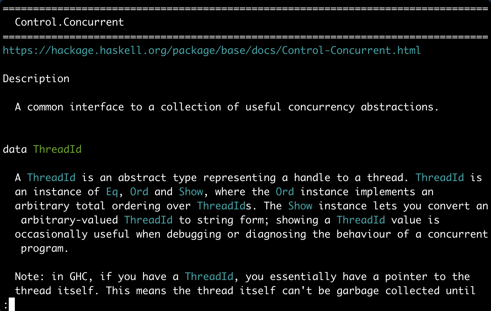

The Haskell ecosystem has great facilities for searching and navigating package documentation using the browser. [`haskell-docs-cli`](https://github.com/lazamar/haskell-docs-cli) allows you to do that much faster without leaving the terminal.

[Jump to demo](#the-commands)

## The problem

Switching focus from the editor to the browser when searching for something on Hoogle or reading a piece of documentation on Hackage is not an ideal workflow. Even having Hoogle as a custom search engine on Chrome and using Vimium to avoid the mouse, the path to the module documentation page requires too many key presses.

Here is an example. Imagine I'm using the `Prettyprinter` module (from the `prettyprinter` package) and want to find out what function will concatenate documents vertically. The best way to do that is to open up the module documentation page and search for the word 'vertical'.

Here is the how to do that in the browser. I'm assuming that a browser window is already open:

1. `Cmd+Tab` - Switch to browser window
2. `Cmd+T` - New tab
3. `h Prettyprint` - Search Hoogle using a custom Chrome search engine.
4. `ArrowDown + Enter` - Select first Hoogle result
5. `Cmd+F` - Start search
6. `vertical` - Search for term
7. `Cmd+W` - Close tab
8. `Cmd+Tab` - Switch back to editor

This is not too bad, but after you do it a bunch of times some points of improvement become clear.

It would be nice to have an option similar to Google's "I'm feelink lucky", where instead of being shown the search results for a term, we jumped straight into the content of the first Hoogle result. Different from Google results this would be much less of a blind gamble into a heavily SEOed page and would most of the times be the result I want.

The change from code editor to browser window is disruptive. Often my browser is already open on my second monitor on a page I'm looking at. This search takes me away from that tab. Additionally, the browser very often leads me to use the mouse, taking my fingers away from the home row.

I navigate file contents very quickly in Vim. It would be really nice to navigate documentation in a similar way, especially the source files of libraries.

Repeated searches could be faster. My memory is bad and I search for the same thing over and over. The Hoogle website performs one search per keystroke and caches those results in memory, but if you reload the page this cache is lost. Hackage pages are not cached. This means that every time I make a repeated search in a new tab I pay the full cost of roundtrips to Hoogle and Hackage servers.

## A faster solution

With these points in mind [`haskell-docs-cli`](https://github.com/lazamar/haskell-docs-cli) was born. It's main goal is to *make navigating Haskell documentation faster*. These are the ideas for how to achieve that:

- Keep me in the terminal. My workflow for juggling multiple terminal sessions is already heavily optimised.
- Results in one jump. There are only a handful of things we may want with documentation (search for type, view module documentation, view function's source, etc.). They are so few that we could have a dedicated command for each case. For example, when I want to view the interface of a module, instead going through `search module name > module docs > module interface`, I could jump directly to the module interface of the first result matching a search term.
- Cache results. If I've searched something, or viewed a piece of documentation recently, the next time I view it the result should show up instantly.

Here is the workflow for the `Prettyprinter` example with `haskell-docs-cli`:
1. Switch to terminal (the shortcut depends on your editor setup)
2. `hdc :md Prettyprinter` - View module documentation of the first Hoogle result for the term `Prettyprinter`. This drops you in a paged view of the documentation, so you can use the same commands you use in `man` pages to navigate the docs.
3. `/vertical` - Search for term in the docs
4. Switch back to editor

That's half the steps of using the browser, keeps the fingers in the home row, caches results, doesn't disturb my open tabs and is in the happy path of terminal/editor switching.

In practice the difference is not only slightly fewer steps, but it becomes much faster to switch from the editor, get the result, navigate through it, and go back.

## The commands

Here is a demo of all the commands available. They are pretty self-explanatory. Notice how quick it is to go straight to the relevant part of the documentation.

There is no network delay in this demo because everything is cached. There is no way one could go through this much documentation in one minute and a half using the Hoogle and Hackage websites directly.

All commands can be replaced by a prefix of the command, so instead of typing `:pinterface base` to view the intreface of the package, you can type just `pi base`.

## How about a local Hoogle?

A local Hoogle focuses on solving a slightly different problem and therefore misses some key features for this use case. It only works with packages you have installed, it requires you to build and maintain a database, it doesn't show full package and module documentation, etc.

`hdc` focuses on improving the convenience and speed of navigating the public Hackage and Hoogle with minimum overhead.

## Can it be better?

Yes. There is more work to be done on `haskell-docs-cli` and you can probably think of ways to make this even faster and more convenient.
In particular it doesn't support specifying package versions yet and doesn't work on Windows.

If you want to collaborate just head to the [GitHub repo](https://github.com/lazamar/haskell-docs-cli) open an issue and PR away.
