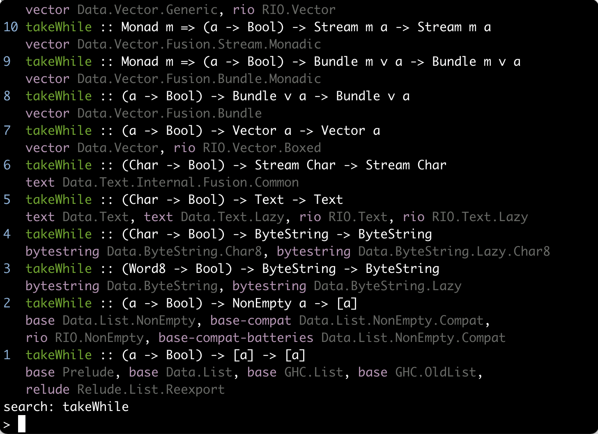

The Haskell ecosystem has great facilities for searching and navigating package documentation using the browser. [`haskell-docs-cli`](https://github.com/lazamar/haskell-docs-cli) allows you to do that much faster without leaving the terminal.

## The problem

I found that switching focus from my editor to the browser when needing to search for something on Hoogle or to read a piece of documentation on Hackage was not really ideal. Even having Hoogle as a custom search engine on Chrome and using Vimium to avoid the need for a the mouse, the path to the documentation page for a module requires too many key presses.

Here is an example scenario. Imagine I'm using the `Prettyprinter` module (from the `prettyprinter` package) and want to find out what function to use to concatenate documents vertically. The best way to do that is to open the module documentation and search for the word 'vertical'.

Here is the workflow for doing that in the browser. I'm assuming that a browser window is already open:

1. `Cmd+Tab` - Switch to browser window
2. `Cmd+T` - New tab
3. `h Prettyprint` - Search Hoogle using a custom Chrome search engine.
4. `ArrowDown + Enter` - Select first Hoogle result
5. `Cmd+F` - Start search
6. `vertical` - Search for term
7. `Cmd+W` - Close tab
8. `Cmd+Tab` - Switch back to editor

This is not too bad, but after you do it a bunch of times some points of improvement become clear.

It would be nice to have an option similar to Google's "I'm feelink lucky", where instead of being shown the search results for a term, we jumped straight into the content of the first Hoogle result. Different from Google results this would be much less of a blind gamble into a heavily SEOed page and would most of the times be the result I want.

The change from code editor to browser window is disruptive. Often my browser is already open on my second monitor on a page I'm looking at. This search takes me away from that tab. Additionally, the browser very often leads me to use the mouse, taking my fingers away from the home row.

I navigate file contents very quickly in Vim. It would be really nice to navigate documentation in a similar way, especially the source files of libraries.

Repeated searches could be faster. My memory is bad an I search for the same thing multiple times. The Hoogle website performs one search per keystroke and caches those results in memory, but if you reload the page this cache is lost. Hackage pages are not cached locally. This means that every time I make a repeated search in a new tab I pay the full cost of roundtrips to Hoogle and Hackage servers.

## A faster solution

With these points in mind [`haskell-docs-cli`](https://github.com/lazamar/haskell-docs-cli) was born. It's main goal is to *make navigating Haskell documentation faster*. These are the ideas for how to achieve that:

- Keep me in the terminal. My workflow for juggling multiple terminal sessions is already heavily optimised.
- Result with one short command. There are only a handful of things we may want with documentation (search for type, view module documentation, view function's source, etc.). They are so few that we could have a dedicated behaviour for each intended action. This means that when I want to view the interface of a module, for example, instead of my trajectory being `search module name > module docs > module interface`, I could jump directly to the module interface of the first result matching a search term.
- Cache results. If I've searched something, or viewed a piece of documentation recently, the next time I view it the result should show up instantly.

Here is the workflow for the `Prettyprinter` example with `haskell-docs-cli`:
1. Switch to terminal (the shortcut depends on your editor setup)
2. `hdc :md Prettyprinter` - View module documentation of the first Hoogle result for the term `Prettyprinter`. This drops you in a paged view of the documentation, so you can use the same commands you use in `man` pages to navigate the docs.
3. `/vertical` - Search for term in the docs
4. Switch back to editor

That's half the steps of using the browser, keeps the fingers in the home row, caches results, doesn't disturb my open tabs and is in the happy path of terminal<->editor switching.

## The commands

The commands are pretty self-explanatory, so here is a demo of almost all of them. Notice how quick it is to go straight to the relevant part of the documentation.

There is no network delay in this demo because I botched the recording a few times so by the end all results were already cached.

<iframe width="560" height="415" src="https://www.youtube.com/embed/PbSYUtMU-r4" title="YouTube video player" frameborder="0" allow="accelerometer; autoplay; clipboard-write; encrypted-media; gyroscope; picture-in-picture" allowfullscreen></iframe>

All commands can be replaced by a prefix of the command, so instead of typing `:pinterface base` to view the intreface of the package, you can type just `pi base`.

### Search

The default action is Hoogle searching, so if you just type a name you will get search results for that.

You will be presented with the results. Conviniently, the most relevant result is at the bottom, close to where you type.

Results are numbered and if you type a number and press Enter, you will expand the result with that number.

### Context

When using numbers you are selecting an option of the current context. In the example above it was the context of a search. You can see that by the line that says `search: takeWhile`.

If we searched for the package interface (modules exposed) of `http-client`, we would see that the context line now says `package: http-client` and a number would select one of the modules from that list.

### Selectors

Commands take a selector. A selector can be one of three things.

It can be a string, which specifies a term to be searched.
It can be a number, which chooses one of the options in the current context.
It can be a forward slash followed by a string. This selects an option from the current context. The string can appear anywhere in the option and pressing `Tab` will complete the match.

Given commands take a selector, when you are looking at a list of results you can call a command on any of the results just by passing the result number (or search prefix) to the command.

### Modules and packages

With both modules and packages there are only two things we could ever want to do: view their documentation or view their interface. For modules the commands are `:module` and `:minterface`, and for packages are `:package` and `:pinterface`.

### View source

To view the source for any declaration just use the `:src` command. It will open the editor specified in the `EDITOR` environment variable.

## How about a local Hoogle?

A local Hoogle focuses on solving a different problem and therefore misses some key features for this use case. It only works with packages you have installed, it requires you to build and maintain a database, it doesn't show full package and module documentation, etc.

## Call for collaboration

There is more work to be done on `haskell-docs-cli`. In particular it doesn't support specifying package versions and doesn't work on Windows.
