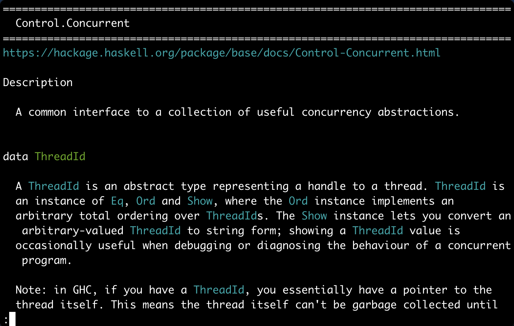

I'm [Marcelo Lazaroni](https://www.linkedin.com/in/lazaroni/), a Portugal-based software developer who plays mainly with Haskell.

<small>Haskell Exchange 2019</small>

I'm into programming languages, databases, and systems software. Much of my work has been in Haskell, particularly around compilers, query languages, and developer infrastructure.

At Meta, I worked on Glean, a system for storing and querying facts about source code.
My work included the Haskell query-language compiler, query evaluation, and performance work.
I recently came back to it, aiming to get recursive query evaluation fully implemented in [Glean](https://github.com/facebookincubator/Glean/issues/736).

I've also worked on developer tooling and distributed systems, and maintain several open-source projects and experiments. More on my <a href="/cv/" title="Résumé">CV</a>.

I'm [@lazamar_](https://www.threads.com/@lazamar_) on Threads.

I write mostly about easy things like programming and algorithms. For the days when I feel like writing about the hard stuff like life and people I have [It's all about focus](http://itsallaboutfocus.com/).

Here are a couple of projects I am working on; contributions are very welcome.

## Projects

## [Glean: recursive query evaluation](https://glean.software/)

Glean is the graph database that powers static analysis and navigation across all of Meta's code.

I originally designed the architecture for recursive query evaluation in Glean while working with Simon Marlow on the Code Search and Indexing team at Meta. In 2026, now as an open-source contributor, I am implementing that design.

The implementation adds demand-driven, bottom-up recursive query evaluation using semi-naive evaluation, suspension/resumption, streaming results, caching, and query-local predicate declarations. It supports mutually recursive predicates and derives only the facts relevant to a query.

It is being merged as a sequence of upstreamable changes, with the complete working implementation and performance tests available on my fork. The design and implementation are documented in Glean [issue #736](https://github.com/facebookincubator/Glean/issues/736).

## [Ambar Emulator](https://github.com/ambarltd/emulator)

The whole Ambar platform in a single statically linked binary that runs on a laptop.
It has Kafka-like high performance partitioned, durable, ordered queues, database consumers, advanced flow control, and replicates an infra setup from a config file.

## [Ambar Tasks](https://github.com/ambarltd/typescript-libs/tree/main/tasks)

Durable, distributed, resumable, and fail-safe workflows embedded in TypeScript applications, with nothing but Postgres behind them. Like Temporal, but with no extra service to run and no separate compilation needed.
Workflows are monadic and can be resumed by replaying cached results, so they can run for days across restarts and crashes. They compose sequentially and in parallel, cancellation is immediate with guaranteed cleanup, and zombie workers fenced off.

The design was inspired by the paper [Composable Memory Transactions](https://simonmar.github.io/bib/papers/stm.pdf).

### [Haskell Docs CLI](https://github.com/lazamar/haskell-docs-cli)

Navigate Hackage documentation from the command line.

[Read the blog post]({{site.baseurl}}/haskell-documentation-in-the-command-line/)

### [Nix Package Versions](https://lazamar.co.uk/nix-versions/)

Find all versions of a package that were available in a Nix channel and the revision you can download it from.

[Read the blog post]({{site.baseurl}}/download-specific-package-version-with-nix/)

### [Silver Magpie](https://lazamar.co.uk/silver-magpie/)

A clean multi-account Twitter client for Google Chrome.

### [Dict Parser](https://github.com/lazamar/dict-parser)

Create a fast parser to match dictionary keys in Elm.

[Read the blog post]({{site.baseurl}}/fast-parsing-of-string-sets-in-elm/)

